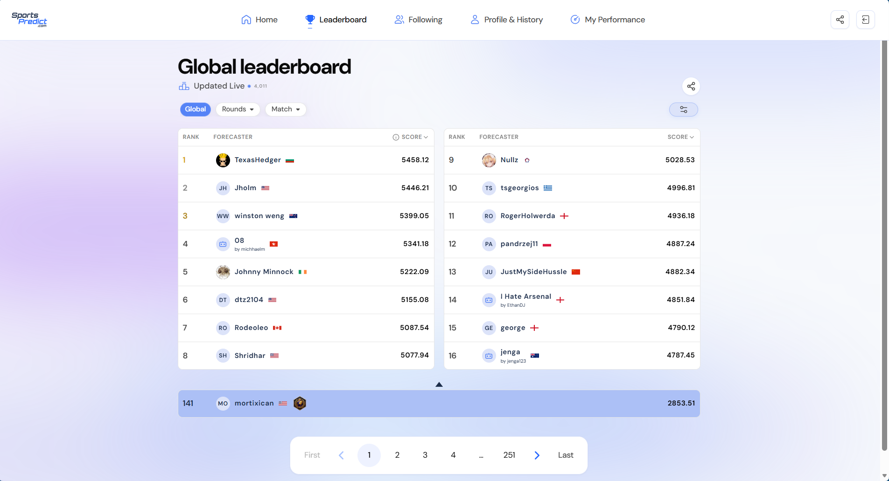
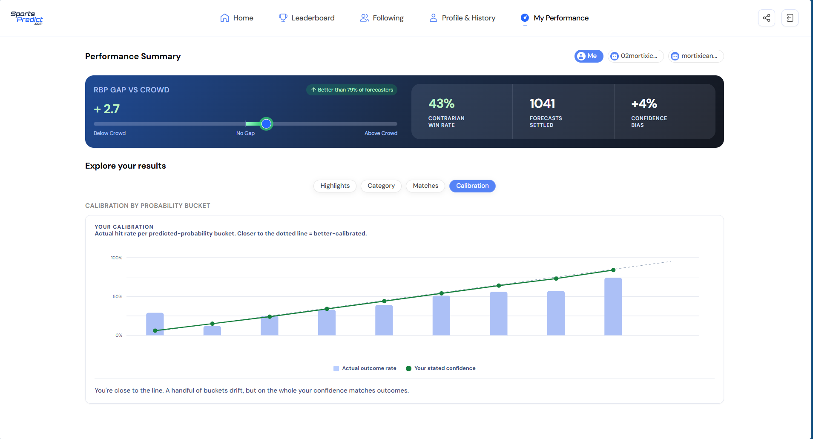
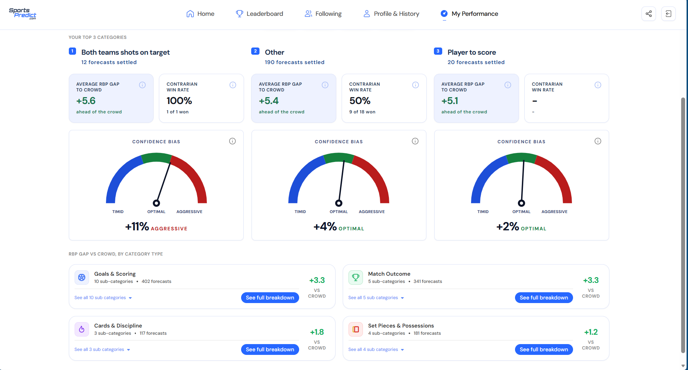
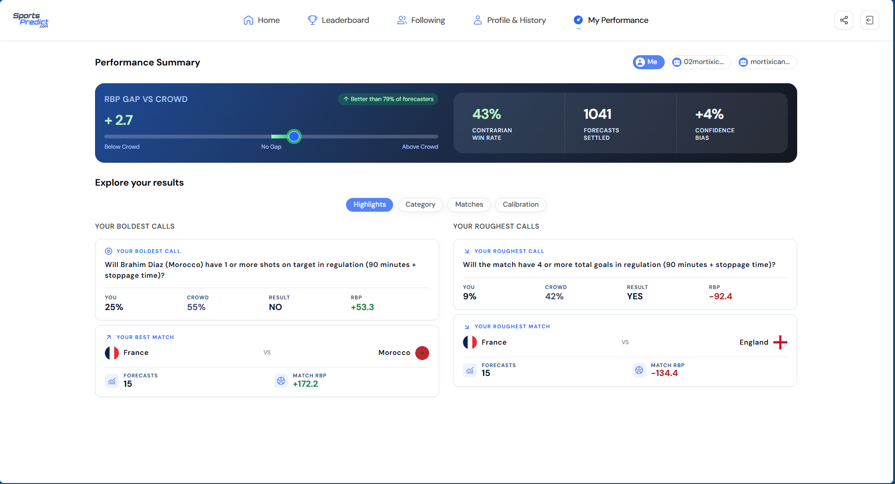
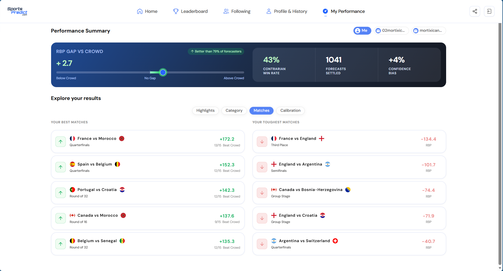

# World Cup 2026 Probabilistic Forecasting Engine

**Result:** Top 3% of 4,000+ participants — Jump Trading Probability Cup (2026 FIFA World Cup)

## Overview

A Python-based forecasting pipeline built as a decision-support system for probabilistic predictions during the 2026 FIFA World Cup. The engine generated base-rate estimates, which were then adjusted through market-implied signals, crowd-bias correction, and conviction weighting to produce final forecasts submitted for scoring.

## System Design

**Model outputs:**
- Poisson-modeled base rates for goals, corners, cards, shots on target, and offsides
- ELO-derived win probabilities
- Kalshi prediction market integration (manual input) as a market-implied prior
- Referee tendency and match-context signals

**Manual layer:**
- Crowd-positioning estimates (anticipated consensus placement)
- Conviction-weighted adjustments using team-specific World Cup data
- Edge identification — flagging which markets to trade vs. skip
- Risk management via a skip framework for position sizing and drawdown control

## Final Results






## Key Insights

Relative Brier scoring rewards distance from the crowd, not just distance from the outcome — accuracy alone isn't sufficient if the field is also accurate. The largest performance gains came from three sources:

1. **Systematic mispricing identification** — targeting player props and rare-event markets where crowd estimates were structurally biased
2. **Selective participation** — a skip framework that cut drawdowns by ~60%, at the cost of some upside on high-variance questions
3. **Market data as primary signal** — weighting Kalshi-implied probabilities above raw model output when the two diverged
   
## How It Works

Built to handle World Cup match volume — multiple matches/day, ~10 questions each. Pulls open markets from SportsPredict's API, runs each question through the forecasting stack, and displays results for review before auto- or manual submission.

**Pipeline, per round:**
1. `api_client.py` — authenticates, joins lobby, pulls open markets
2. `question_classifier.py` — categorizes each question (goals, cards, SOT, corners, player props) and extracts metadata (half-specific, thresholds, AND/OR logic)
3. `elo_data.py` / `base_rates.py` — ELO win probabilities + confederation/tier-adjusted base rates
4. `sofascore_collector.py` — pulls recent per-game team averages (goals, SOT, corners, fouls, offsides)
5. `match_context.py` / `referee_data.py` / `player_data.py` — tournament stage, tactics, confirmed starters, referee tendencies
6. `kalshi_markets.py` / `market_data.py` — real-time Kalshi prices, de-vigged, flagged sharp vs. soft
7. `math_engine.py` — Poisson calculations, AND/OR probability logic, market anchoring
8. `forecaster.py` — orchestrates: Kalshi → Math → LLM fallback → Hard caps → Crowd bias → Conviction weighting → Final probability
9. `main.py` — entry point; runs a full round, outputs a formatted prediction table, submits via API

**Example output:**

**Example output:**

| Question | % | Source |
|---|---|---|
| Will France win the match? | 91% | SHARP |
| Will both teams score AND 3+ goals? | 27% | market |
| Will Iraq score in the second half? | 25% | math_base |
| Will a penalty kick be awarded OR red card shown? | 28% | llm_base |
| Will Sadio Mané score a goal? | 17% | market |

*Source key: `market` = Kalshi-derived, `sharp` = high-volume/high-liquidity Kalshi market (weighted more heavily), `math_base` = Poisson/ELO model output, `llm_base` = LLM fallback for compound or ambiguous questions.*

## Usage

1. Install dependencies: `pip install -r requirements.txt`
2. Add keys to `.env`: `GEMINI_API_KEY`, `SPORTSPREDICT_API_KEY`, `KALSHI_API_KEY`
3. Update pre-match files: `kalshi_markets.py` (ticker IDs), `referee_data.py` (assigned ref's rates), `match_context.py` (stage, tactics, starters)
4. Run:
```bash
   python main.py                       # all open matches
   python main.py --match "France"      # specific match
   python main.py --submit              # auto-submit
   python main.py --match "France" --submit
```
5. Review output, adjust if needed, submit.

**Typical workflow:** ~10-15 min/match — update context, run, review, adjust, submit.
**Scale:** ~40-60 questions/day across 4-6 concurrent matches at peak.

## Tech Stack

- **Python** — NumPy, SciPy, Requests
- **Poisson distribution modeling** — goal/event rate estimation
- **ELO rating system** — win probability estimation
- **Kalshi API** — real-time prediction market data
- **SofaScore API** — team and match statistics
- **Google Gemini API** — LLM fallback for complex/compound questions
